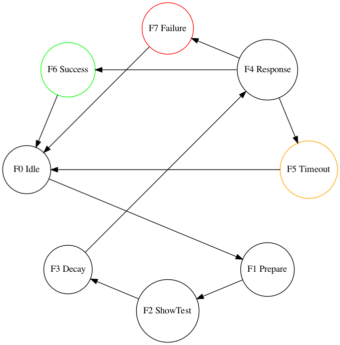
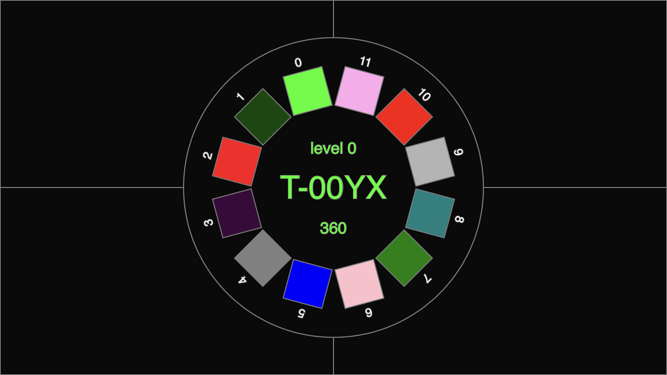
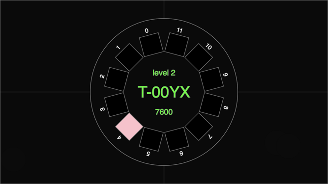
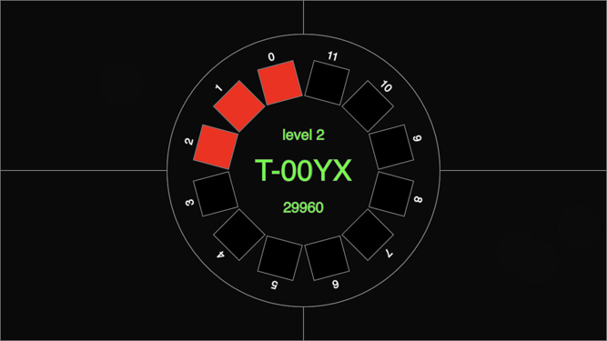
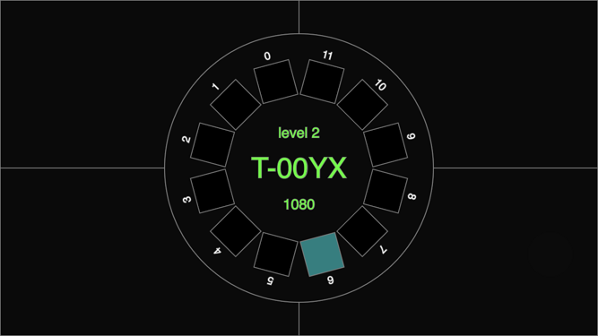
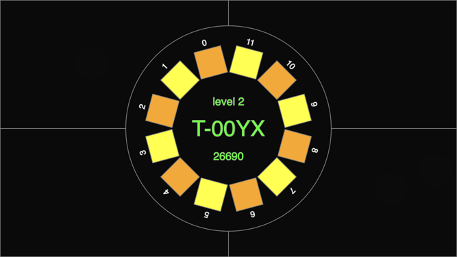
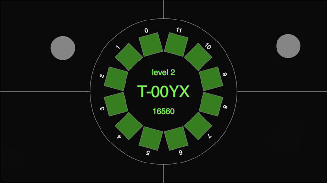
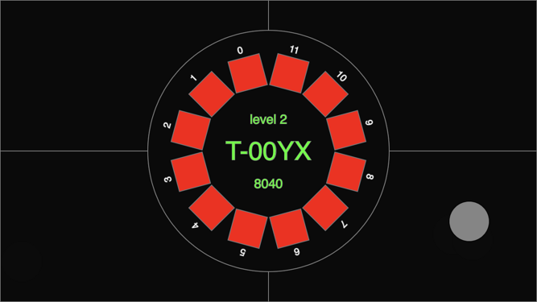

# DONALD 2021

# Introduction

Donald-2021 is named after [Donald Norman](https://en.wikipedia.org/wiki/Don_Norman), one of the fathers of Interaction Design and is a [short-term memory tester](https://en.wikipedia.org/wiki/Short-term_memory) to be used in various applications.

The learning goal is to experience using hardware to gather quantitative user data for optimising human-machine interaction and to determine a threshold for satisfactory performance for certain tasks.

Donald used to be a hardware device implemented as an Arduino, an AUAS electronic board, and a Raspberry Pi based device using 4 touch controls and a 12 color LED ring for visual feedback and display.

In course year 2021 this was changed to a web application due to the corona pandemic.

## state machine

The memory tester is implemented using a [state machine](https://en.wikipedia.org/wiki/Finite-state_machine)



The animation steps are as follows:

### F0 IDLE


### F1 WARN


### F2 SHOW


### F3 DECAY


### F4 COUNTDOWN


### F0 TIMEOUT


### F0 SUCCESS


### F0 FAILURE


# User Interaction - Timings


The _User Interaction_ can be optimized by editing the timing parameters in a copy of the `animations-x.js` files.

| Timing Param | PARAMS-0 | PARAMS-1 | PARAMS-2 | PARAMS-3 | PARAMS-4 |
| :----------- | :------- | :------- | :------- | :------- | :------- |
| T0_IDLE      | 10       | 20       | 20       | 30       | 30       |
| T1_WARN      | 60       | 60       | 120      | 120      | 180      |
| T3_SHOW      | 20       | 40       | 40       | 30       | 30       |
| T4_DECAY     | 60       | 120      | 120      | 90       | 180      |
| T4_COUNTDOWN | 240      | 300      | 360      | 420      | 420      |

Timing is in 'frames' where we assume a frame rate of **60 fps**.

## User Experience - Animations

The _User Experience_ can be improved by changing the animation functions in a copy of the `animations.js` files.

An animation function is called every couple of frames and looks like this:

```
//
//  F3 decay is where your short senory and term memory slowly fades away
//
//
var decayColors = new Array(
  'blue', // named color
  'blue', // named color
  'blue', // named color
  'blue', // named color
  'blue', // named color
  'blue', // named color
  'black', // named color
  'black', // named color
  'black', // named color
  'black', // named color
  'black', // named color
  'black' // named color
  );

function showDecay() {
  if (frameCount % (T3_DECAY / 12) == 0) {
    showLeds(decayColors);
    decayColors.rotateRight(3);
  }
}
```

## Result Data format

result sets retrieved with the form look like this:

```
T-00ZI	1	PARAMS-0	10	60	20	60	240	3,0	3,0	correct	139	0	412x766	2021-01-22 16:49:10.791342
T-00ZI	2	PARAMS-0	10	60	20	60	240	3,2,2	3,2,2	correct	100	0	412x766	2021-01-22 16:49:21.104859
T-00ZI	3	PARAMS-0	10	60	20	60	240	1,3,3,0	1,3,3,3	wrong	238	1	412x766	2021-01-22 16:49:34.688279
T-00ZI	4	PARAMS-0	10	60	20	60	240	1,3,2	1,3,3	wrong	80	1	412x766	2021-01-22 16:49:44.488560
T-00ZI	5	PARAMS-0	10	60	20	60	240	0,2	2	wrong	50	2	412x766	2021-01-22 16:49:52.845412
T-00ZI	6	PARAMS-0	10	60	20	60	240	2	1	wrong	39	1	412x766	2021-01-22 16:50:00.389465
T-00ZI	7	PARAMS-0	10	60	20	60	240	0,1	0,1	correct	67	0	412x766	2021-01-22 16:50:11.589195
T-00ZI	8	PARAMS-0	10	60	20	60	240	2,0,0	2,0,0	correct	100	0	412x766	2021-01-22 16:50:21.464358
T-00ZI	9	PARAMS-0	10	60	20	60	240	2,3,0,1	2,3,3	wrong	74	2	412x766	2021-01-22 16:50:31.689789
T-00ZI	10	PARAMS-0	10	60	20	60	240	3,3,0	3,3,0	correct	111	0	412x766	2021-01-22 16:50:41.561363
T-00ZI	11	PARAMS-0	10	60	20	60	240	3,0,1,0	3,0,0	wrong	105	2	412x766	2021-01-22 16:50:52.018799
T-00ZI	12	PARAMS-0	10	60	20	60	240	0,2,0	0,2,0	correct	108	0	412x766	2021-01-22 16:51:02.092671
T-00ZI	13	PARAMS-0	10	60	20	60	240	2,2,3,3	2,2,2	wrong	69	2	412x766	2021-01-22 16:51:11.945056
T-00ZI	14	PARAMS-0	10	60	20	60	240	0,1,2	0,1,1	wrong	80	1	412x766	2021-01-22 16:51:21.529807
T-00ZI	15	PARAMS-0	10	60	20	60	240	3,0	3,0	correct	78	0	412x766	2021-01-22 16:51:30.589170
T-00ZI	16	PARAMS-0	10	60	20	60	240	3,3,2	3,3,2	correct	129	0	412x766	2021-01-22 16:51:41.207195
T-00ZI	17	PARAMS-0	10	60	20	60	240	0,0,1,3	0,0,1,3	correct	197	0	412x766	2021-01-22 16:51:53.891014
T-00ZI	18	PARAMS-0	10	60	20	60	240	0,3,2,1,3	0,3,2,1,1	wrong	163	1	412x766	2021-01-22 16:52:06.367124
T-00ZI	19	PARAMS-0	10	60	20	60	240	3,2,3,2	3,2,3,3	wrong	120	1	412x766	2021-01-22 16:52:17.210425
```

This sequence is composed of:
 - testID
 -  testCounter
 - test PARAMS set
 - T0_IDLE
 - T1_WARN
 - T2_SHOWTEST
 - T3_DECAY
 - T4_COUNTDOWN
 - requested sequence
 - recorded sequence
 - status _correct | wrong | timeout_
 - elapsed time in _frames_ at 60 fps
 - remaining levels at which error or timeout occurred, the current level is the length of the requested sequence
 - windowHeight x windowWidth
 - date+time stamp

## Tools

Javascript developed using [p5js](https://p5js.org) with [Processing](https://processing.org).
Web backend developed using [python](https://python.org) and [Flask](https://palletsprojects.com/p/flask/)
